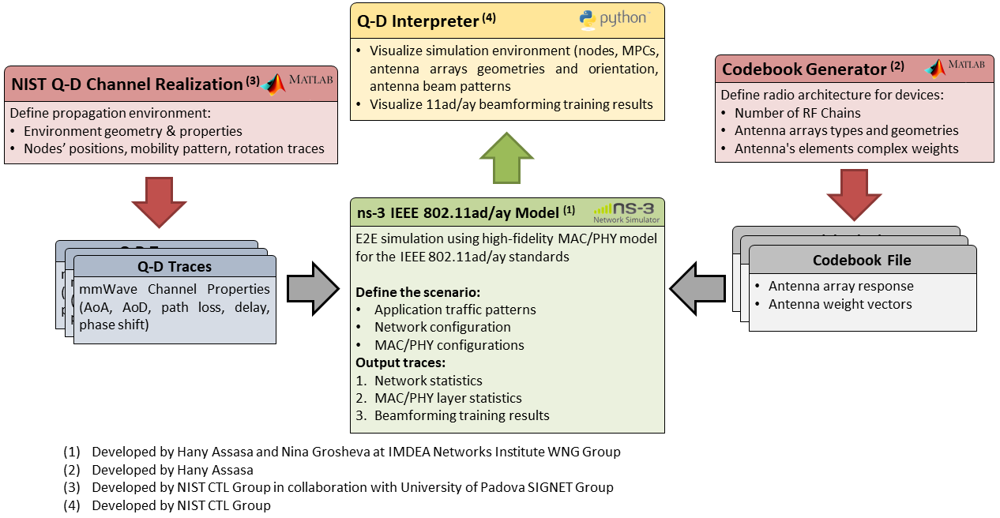

## Introduction
This is the official repository for the development of the WiGig module network simulator ns-3. The WiGig module introduces a wireless network interface controller based on the WLAN IEEE 802.11ad/ay standards. IEEE 802.11ad/ay standards support wireless networking in the unlicensed 60 GHz band. Our implementation paves the way to perform high fidelity simulations for large dense wireless networks consisting of devices with heterogeneous capabilities and constraints. 

### WiGig Framework Architecture
We provide a **high-fidelity** and **open-source** simulation framework for evaluating the IEEE 802.11ad/ay standards. Our framework consists of four software tools as depicted in the below figure:

1. **ns-3 IEEE 802.11ad/ay model:** This is the core of our framework. The model is based on the WiFi module in ns-3. It provides a highly accurate implementation of the IEEE 802.11ad/ay MAC layer with an abstracted PHY layer implementation. Additionally, we provide a realistic millimeter-wave channel model based on channel profiles generated by 60 GHz ray-tracing software.  
1. **Codebook/Beambook Generator:** This is a MATLAB-based application to design codebook instances that define the beam patterns of the phased antenna array(s) within an IEEE 802.11ad/ay enabled device.
1. **NIST Q-D Channel Realization Software:** It is a ray-tracing software developed in MATLAB for accurate indoor and outdoor millimeter-wave channel modeling.
1. **Q-D Interpreter:** It is a Python-based application to visualize the beamforming results obtained through the ns-3 IEEE 802.11ad/ay model together with the simulated scenario generated by the Q-D Realization Software.

### Framework Objectives
1. Provides a high-fidelity research tool for studying, modeling, and analyzing 60 GHz WLAN standards.
1. Allows researchers from academia and industry to design innovative solutions to improve wireless networking in the 60 GHz band. As the IEEE 802.11ad/ay standards leave many points implementation-dependent, users can utilize our framework to propose ideas and evaluate their performance ahead of an actual implementation.
1. Serves as a network planning tool for wireless network operators. The model allows simulating large dense 60 GHz wireless networks before deployment.

## WiGig Module Features
We list the supported features based on the standard.

###  IEEE 802.11ad Features
1. DMG Channel Access Periods (BTI/A-BFT/ATI/DTI with both CBAP and Service Periods).
1. Beamforming Training (BT) in both BHI and DTI access periods.
1. DMG PLCP Model for 802.11ad frame transmission and reception.
1. Abstract DMG PHY layer implementation for DMG CTRL/SC/OFDM.
1. Beamforming Codebook design for beamforming training and beam steering.
1. Fast Session Transfer (FST) mechanism.
1. Dynamic allocation of service period (Polling).
1. Service period allocation.
1. DMG Relay support (Full-duplex and half-duplex modes).
1. Beamformedlink maintenance for service period allocation.
1. Decentralized clustering support.
1. Spatial sharing and interference assessment mechanism. 
1. Quasi-deterministic channel model to simulate real propagation environments.
1. Multi-antenna beamforming training support.
1. Accurate BER vs. SNR lookup tables for all DMG PHY modes.
1. Beam refinement for both transmit and receive beam patterns.
1. Multi-AP support without the need for decentralized clustering.
1. A comprehensive set of examples and tutorials for each feature.

### IEEE 802.11ay Features
The IEEE 802.11ay implementation is an extension to our IEEE 802.11ad model, and it supports the following list of features:

1. IEEE 802.11ay PHY frame structure, new MAC frame formats, and new Information Elements.
1. Advanced beamforming techniques (EDMG BRP PPDU and short SSW frame).
1. Channel bonding up to four channels.
1. Channel transmit masks for all channel configurations in IEEE 802.11ay.
1. SU-MIMO beamforming training and channel access procedures.
1. MU-MIMO beamforming training procedure.
1. MIMO Q-D channel interface.
1. A comprehensive set of examples for MIMO communication and 11ay throughput validation.

## Installation and Usage

### Prerequisites
Before using our WiGig module, please do the following:

1. Familiarize yourself with ns-3 and how to install and run simulations in ns-3. Have a look at the official tutorial page of the simulator.
1. Understand WLAN IEEE 802.11 MAC/PHY operations. There are plenty of references on the Internet describing the CSMA/CA protocol and the evolution of the 802.11 protocol.
1. Understand the existing Wifi Model in ns-3 which implements WLAN IEEE 802.11a/b/g/n/ac/ax/be.
1. Read our publications below to understand our implementation.
1. Consult our [Wiki page](https://github.com/wigig-tools/wigig-module/wiki) for more detailed information regarding our implementation.

Once you have completed all these steps, you can proceed with cloning and building the project.

### Building the Project
Clone the project to your local system using the following command:

     git clone https://github.com/wigig-tools/wigig-module.git

To build the project in debug mode, type the following commands:

    ./waf configure --disable-examples --disable-tests --disable-python --enable-modules='core','applications','wifi','spectrum','flow-monitor','point-to-point','buildings'
    ./waf build

To build the project in optimized mode for fast execution type the following commands:

    ./waf configure --disable-examples --disable-tests --disable-python --enable-modules='applications','core','internet','point-to-point','wifi','flow-monitor','spectrum' --enable-static -d optimized
    ./waf build

Warning: The previous command will generate large executable files. Make sure you have enough free space in your system.

### How to Run
Our WiGig module includes an extensive set of tutorial scripts located in the scratch folder. A user can explore these examples to test and validate the performance of our framework. At the beginning of each simulation script, we added a detailed description regarding the tested functionality, network topology, expected output, and usage method. 

## Publications
The following papers include background on IEEE 802.11ad/ay, implementation details, and evaluation for the WiGig model. If you use our framework in your research, please cite the following papers: 

* Hany Assasa, Nina Grosheva, Tanguy Ropitault, Steve Blandino, Nada Golmie, and Joerg Widmer
**[Implementation and Evaluation of a WLAN IEEE 802.11 ay Model in Network Simulator ns-3](https://dl.acm.org/doi/10.1145/3460797.3460799)**
The Workshop on ns-3 (WNS3), 23-24 June 2021, Virtual Event.
* Hany Assasa, Joerg Widmer, Jian Wang, Tanguy Ropitault, and Nada Golmie.
**[An Implementation Proposal for IEEE 802.11ay SU/MU-MIMO Communication in ns-3](https://dl.acm.org/citation.cfm?id=3337947)**
Proceedings of the 2019 Workshop on Next-Generation Wireless with ns-3 (WNGW 2019), 21 June 2019, Florence, Italy.
* Hany Assasa, Joerg Widmer, Tanguy Ropitault, Anuraag Bodi, and Nada Golmie.
**[High Fidelity Simulation of IEEE 802.11ad in ns-3 Using a Quasi-deterministic Channel Model.](https://dl.acm.org/citation.cfm?id=3337946)**
Proceedings of the 2019 Workshop on Next-Generation Wireless with ns-3 (WNGW 2019), 21 June 2019, Florence, Italy.
* Hany Assasa, Joerg Widmer, Tanguy  Ropitault, and Nada Golmie.
**[Enhancing the ns-3 IEEE 802.11ad Model Fidelity: Beam Codebooks, Multi-antenna Beamforming Training, and Quasi-deterministic mmWave Channel.](https://dl.acm.org/citation.cfm?id=3321354)**
The Workshop on ns-3 (WNS3), 19-20 June 2019, Florence, Italy.
* Hany Assasa, and Joerg Widmer.
**[Extending the IEEE 802.11ad Model: Scheduled Access, Spatial Reuse, Clustering, and Relaying.](https://dl.acm.org/citation.cfm?id=3067667)**
The Workshop on ns-3 (WNS3), 13-14 June 2017, Porto, Portugal.
* Hany Assasa, and Joerg Widmer.
**[Implementation and Evaluation of a WLAN IEEE 802.11ad Model in ns-3.](https://dl.acm.org/citation.cfm?id=2915377)**
The Workshop on ns-3 (WNS3), 15-16 June 2016, Seattle, WA, USA.

## Project Road-map
We are working on the following set of IEEE 802.11ay features for our next release:
1. Multi-channel scheduling.
1. Accurate modeling for non-duplicate frame transmission and reception.
1. Extending SU-MIMO implementation to support beamforming training and data communication in dense network deployment.
1. MU-MIMO channel access procedure.
1. Hybrid beamforming protocol (Analog and digital beamforming). 
1. Time-division duplexing (TDD) protocol for mmWave distribution networks/fixed wireless access (FWA).

## Authors
The WiGig module and Codebook Generator Application is developed and maintained by:

1. [Hany Assasa](https://www.linkedin.com/in/hany-assasa/) (Project leader).
1. [Nina Grosheva](https://networks.imdea.org/team/imdea-networks-team/people/nina-grosheva/)

## Bug Reporting
When you come across a bug during the usage of the original model, please report the problem to the following email address (hany.assasa@gmail.com). In the email, please include the following:

1. Simulation file with a brief description of the simulated scenario and the expected output.
1. The set of input parameters that caused the simulation to crash.

Please do not report any problem related to your modification of the original code.
